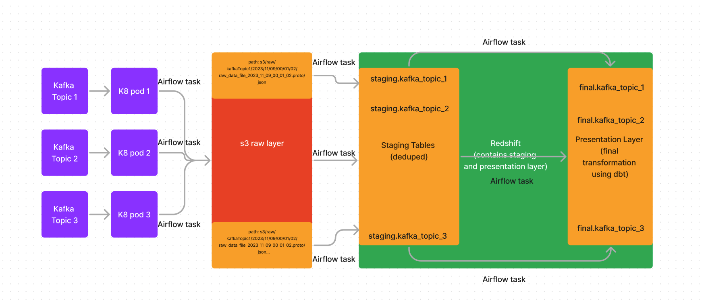

# Data LakeHouse Architecture

What patterns have we seen work in the wild? Let's diagram it.

## Approach

We will ingest data from Kafka to s3 (our data lake). From s3 (our raw data layer) we will load the data into our staging area (in redshift) for further transformation. From there, we will use DBT to dedupe the data into our first presentation layer. 

## Diagram

This is a real world implementation of a data lakehouse that I've seen in the wild.

## Explanation

A medallion architecture is a data design pattern used to logically organize data in a lakehouse, with the goal of incrementally and progressively improving the structure and quality of data as it flows through each layer of the architecture (from Bronze ⇒ Silver ⇒ Gold layer tables). Medallion architectures are sometimes also referred to as "multi-hop" architectures.

### Bronze/Raw layer

The Bronze layer is where we land all the data from external source systems. The table structures in this layer correspond to the source system table structures "as-is," along with any additional metadata columns that capture the load date/time, process ID, etc. The focus in this layer is quick Change Data Capture and the ability to provide an historical archive of source (cold storage), data lineage, auditability, reprocessing if needed without rereading the data from the source system.

The bronze layer is usually a reservoir that stores data in its natural and original state. It contains unvalidated data (without having to first define schemas). In this layer you either get data using full loads or delta loads. Data that is stored in bronze has usually the following characteristics:

- Maintains the raw state of the data source in the structure “as-is”.
- Data is immutable (read-only).
- Managed using interval partitioned tables, for example, using a YYYYMMDD or datetime folder structure.
- Retains the full (unprocessed) history of each dataset in an efficient storage format, for example, Parquet or Delta.
- For transactional data: Can be appended incrementally and grow over time.
- Provides the ability to recreate any state of a given data system.
- Can be any combination of streaming and batch transactions.
- May include extra metadata, such as schema information, source file names or recording the time data was processed.

The bronze layer contains unvalidated data. Data ingested in the bronze layer typically:
- Maintains the raw state of the data source.
- Is appended incrementally and grows over time.
- Can be any combination of streaming and batch transactions.

Why? Retaining the full, unprocessed history of each dataset in an efficient storage format provides the ability to recreate any state of a given data system. Additional metadata (such as source file names or recording the time data was processed) may be added to data on ingest for enhanced discoverability, description of the state of the source dataset, and optimized performance in downstream applications.

### Silver/Staging Layer

In the Silver layer of the lakehouse, the data from the Bronze layer is matched, merged, conformed and cleansed ("just-enough") so that the Silver layer can provide an "Enterprise view" of all its key business entities, concepts and transactions. (e.g. master customers, stores, non-duplicated transactions and cross-reference tables).

The Silver layer brings the data from different sources into an Enterprise view and enables self-service analytics for ad-hoc reporting, advanced analytics and ML. It serves as a source for Departmental Analysts, Data Engineers and Data Scientists to further create projects and analysis to answer business problems via enterprise and departmental data projects in the Gold Layer.

In the lakehouse data engineering paradigm, typically the ELT methodology is followed vs. ETL - which means only minimal or "just-enough" transformations and data cleansing rules are applied while loading the Silver layer. Speed and agility to ingest and deliver the data in the data lake is prioritized, and a lot of project-specific complex transformations and business rules are applied while loading the data from the Silver to Gold layer. From a data modeling perspective, the Silver Layer has more 3rd-Normal Form like data models.

- Dedupe here. Recall that while the bronze layer contains the entire data history in a nearly raw state, the silver layer represents a validated, enriched version of our data that can be trusted for downstream analytics. While Databricks believes strongly in the lakehouse vision driven by bronze, silver, and gold tables, simply implementing a silver layer efficiently will immediately unlock many of the potential benefits of the lakehouse.

### Gold/Presentation Layer

Data in the Gold layer of the lakehouse is typically organized in consumption-ready "project-specific" databases. The Gold layer is for reporting and uses more de-normalized and read-optimized data models with fewer joins. The final layer of data transformations and data quality rules are applied here. Final presentation layer of projects such as Customer Analytics, Product Quality Analytics, Inventory Analytics, Customer Segmentation, Product Recommendations, Marking/Sales Analytics etc. fit in this layer. We see a lot of Kimball style star schema-based data models or Inmon style Data marts fit in this Gold Layer of the lakehouse.

In a Lakehouse architecture, the Gold layer houses data that is structured in “project-specific” databases, making it readily available for consumption. This integration of data from various sources may result in a shift in data ownership. As for the Gold layer, I suggest utilizing a denormalized and read-optimized data model with fewer joins, such as a Kimball-style star schema, depending on your specific use cases

In general, because aggregations, joins, and filtering are handled before data is written to the gold layer, users should see low latency query performance on data in gold tables.

#### Benefits of a lakehouse architecture
- Simple data model
- Easy to understand and implement
- Enables incremental ETL
- Can recreate your tables from raw data at any time
- ACID transactions, time travel
- Medallion architecture and data mesh. The Medallion architecture is compatible with the concept of a data mesh. Bronze and silver tables can be joined together in a "one-to-many" fashion, meaning that the data in a single upstream table could be used to generate multiple downstream tables.

Another diagram:

