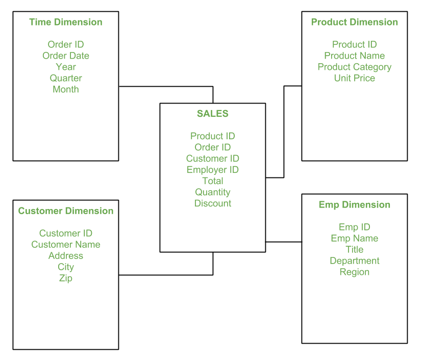

## Cardinality
Low cardinality refers to a database that has a lot of repeated values, such as status flags, Boolean values, or gender. High cardinality refers to a database that has a large number of distinct values, such as ID numbers, user names, or email addresses.
 
For example, a “status” field with “Open” and “Closed” values would be classed as having low cardinality because it has only two distinct values. A table with 100,000 rows has 100,000 unique values in the vin column because VINs are unique.
 
Cardinality refers to the number of distinct values that a column can take on. A column with high cardinality has a large number of distinct values, while a column with low cardinality has a small number of distinct values (low cardinality columns means a lot of repeats which is a good candidate for further normalization and breaking out into further tables). In the context of a database, cardinality is a measure of the uniqueness of values in the data. Low cardinality means few unique values; high cardinality means many unique values.

In a snowflake schema, a fact is surrounded by its associated dimensions (as in a star schema), but those dimensions are further related to other dimensions, branching out into a snowflake pattern. Snowflaking normalizes the dimensions by moving attributes with low cardinality into separate dimension tables.

## Fact vs Dimensions

### Facts
Facts are the measurable data elements that represent the business metrics of interest. For example, in a sales data warehouse, the facts might include sales revenue, units sold, and profit margins. Each fact is associated with one or more dimensions, creating a relationship between the fact and the descriptive data.

The fact table in a star schema contains the measures or metrics that are of interest to the user or organization. For example, in a sales data warehouse, the fact table might contain sales revenue, units sold, and profit margins. Each record in the fact table represents a specific event or transaction, such as a sale or order.

### Dimension
Dimensions are the descriptive data elements that are used to categorize or classify the data. For example, in a sales data warehouse, the dimensions might include product, customer, time, and location. Each dimension is made up of a set of attributes that describe the dimension. For example, the product dimension might include attributes such as product name, product category, and product price.

## Star Schema

Star schema is the fundamental schema among the data mart schema and it is simplest. This schema is widely used to develop or build a data warehouse and dimensional data marts. It includes one or more fact tables indexing any number of dimensional tables. The star schema is a necessary cause of the snowflake schema. It is also efficient for handling basic queries. 

It is said to be star as its physical model resembles to the star shape having a fact table at its center and the dimension tables at its peripheral representing the star’s points. Below is an example to demonstrate the Star Schema:

 
