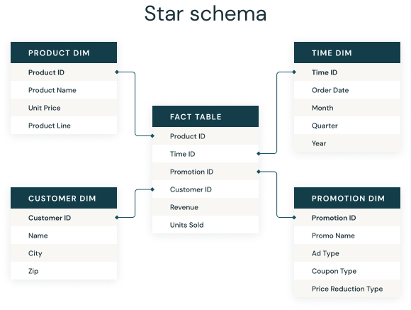

# Star Schema

A star schema is a multi-dimensional data model used to organize data in a database so that it is easy to understand and analyze. Star schemas can be applied to data warehouses, databases, data marts, and other tools. The star schema design is optimized for querying large data sets.

Introduced by Ralph Kimball in the 1990s, star schemas are efficient at storing data, maintaining history, and updating data by reducing the duplication of repetitive business definitions, making it fast to aggregate and filter data in the data warehouse.

A star schema is used to denormalize business data into dimensions (like time and product) and facts (like transactions in amounts and quantities).

A star schema has a single fact table in the center, containing business "facts" (like transaction amounts and quantities). The fact table connects to multiple other dimension tables along "dimensions" like time, or product. Star schemas enable users to slice and dice the data however they see fit, typically by joining two or more fact tables and dimension tables together.

Star schemas denormalize the data, which means adding redundant columns to some dimension tables to make querying and working with the data faster and easier. The purpose is to trade some redundancy (duplication of data) in the data model for increased query speed, by avoiding computationally expensive join operations.

## Denormalization vs normalization

Denormalization is the process of combining data from multiple tables into a single table to make data retrieval faster. Normalization is the technique of dividing data into multiple tables to reduce data redundancy and inconsistency and to achieve data integrity. 

Denormalization can improve the read performance of a normalized relational database. It can also be used to get rid of too many joins if queries are running too slowly

In the database design scope, Normalization is a database design technique that organizes tables in a manner that reduces redundancy and dependency of data by minimizing the insertion, deletion and update anomalies through eliminating the redundant data. 

See the images here. https://medium.com/analytics-vidhya/database-normalization-vs-denormalization-a42d211dd891

Normalization is the technique of dividing the data into multiple tables to reduce data redundancy and inconsistency and to achieve data integrity. On the other hand, Denormalization is the technique of combining the data into a single table to make data retrieval faster.

As the opposite, Denormalization is the inverse process of normalization where the redundancy is added to the data intentionally to improve the performance of the specific application and data integrity. The reason for performing denormalization is the overheads produced in the query processor by an over-normalized structure. Denormalization reduces the number of tables, and the complicated table joins because a higher number of joins can slow down the process.

In this model, the fact table is normalized but the dimensions tables are not. That is, data from the fact table exists only on the fact table, but dimensional tables may hold redundant data.

Normalization and denormalization are useful according to the situation. Normalization is used when the faster insertion, deletion and update anomalies, and data consistency are necessarily required. On the other hand, Denormalization is used when the faster search is more important and to optimize the read performance. It also lessens the overheads created by over-normalized data or complicated table joins.

### How does a star schema differ from 3NF (Third Normal Form)?
3NF, or Third Normal Form, is a method of reducing data-redundancy through normalization. It is a common standard for databases that are considered fully normalized. It typically has more tables than a star schema due to data normalization. On the flip-side, queries tend to be more complex due to the increased number of joins between large tables.

