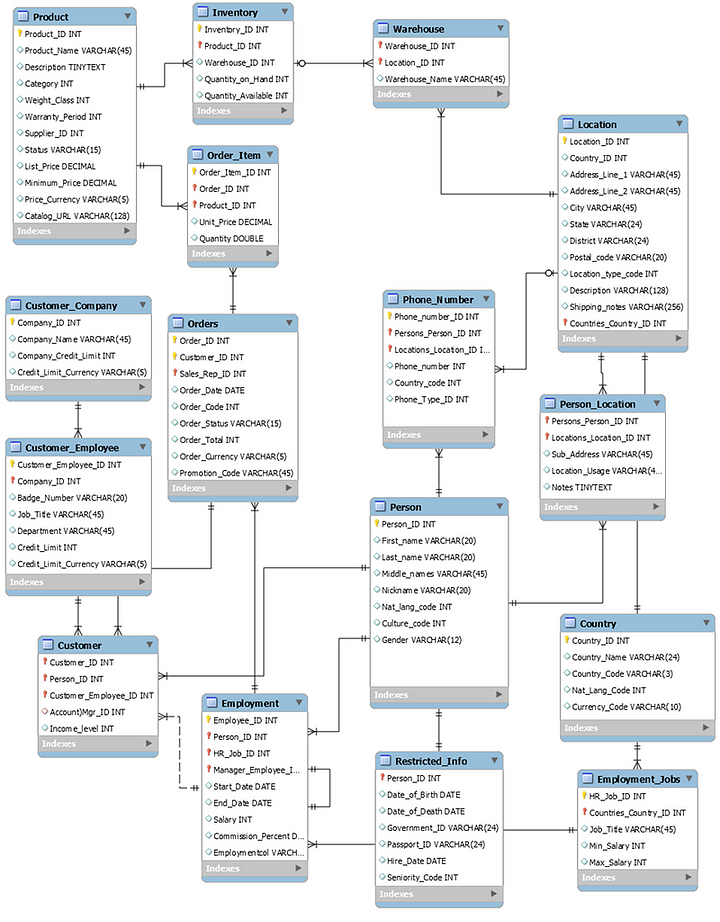
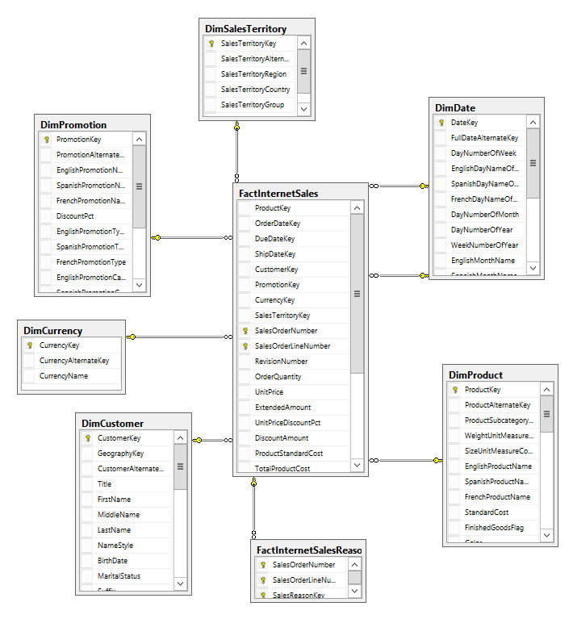

# Background
The purpose of this article is to provide a quick overview of what a Star Schema is in data warehousing and why it is important for growing businesses to centralise data across their enterprise.

## What is a star schema data warehouse model and how does it differ from a traditional transactional database model?

### Transactional
A typical transactional database (aka relational database) is used by businesses to store discrete, business transactional data e.g. sales, inventory, purchase orders etc., and each database is specific to a particular business or business functional area e.g. The Sales database stores sales transactions, the Finance database stores general ledger,budget,forecast etc. finance specific information.

In database terminology the typical data model involved with these databases is called the 3rd Normal Form (3NF). Such databases are considered highly ‘normalised’. This means that the data is stored with an emphasis on the following design considerations:

- Minimal data redundancy: There are many, many single-purpose specific tables which are related to one or more other tables using a system of primary and foreign keys to ensure uniqueness of records within each table, and the same field is not replicated in multiple tables with the exception of key fields or internal system fields (e.g. ID, created_date, created_by_user etc.).
- Optimised for fast read + fast write: Lightning fast performance to commit a transaction is crucial to enabling a transactional system to handle large numbers of transactions and processing and fast read is equally as important to enable the data to be surfaced in the system presentation layer, operational reporting as well as for downstream processing (e.g. interprocess communication and ETL processing where data is being extracted, optionally transformed and exported to another system).
- Current data only: The data in the database is live data that represents what is factually true as at the current date. An example of this is, in a transactional table that stores customers, a single record in this table will always store the current customer’s actual information that is current as at today. The First_Name field will always show the customer’s current First Name, the Telephone_Number field will always show the customer’s current telephone number etc.
- Realtime data: Transactional databases are the source of truth of data as collected from the real world e.g. for a retail database, a sales transaction at the point of sale is committed into the transactional database in realtime when a customer makes a transaction.

E.g. an example of a transactional/relational database schema

### Star

By comparison a traditional data warehouse is used by businesses to store facts (or transactional data) from one or more areas of a business enterprise in a single database using two types of tables, dimension tables and fact tables.

Dimension tables store the descriptive attributes of entities across the business enterprise and function as common lookup tables e.g. product categories, team names, customer names, addresses etc.

Fact tables are designed per business process and store purely numerical facts (or transaction data) that are commonly aggregated for reporting purposes and link to dimension table through foreign key fields.

The combination of central Fact tables being related to many dimension tables is what is commonly referred to as a star schema data model. There are other schemas around e.g. Snowflake and Hybrid models which are also used but this article focuses on star schemas.

A star schema model is designed with the following in mind:

- Redundant data storage for performance: Data is stored in significantly fewer tables than a typical transactional database, which are NOT in 3NF which means columns in a table contains data which is repeated throughout the table. This is done to assist in optimising read performance.
- Fast reads only: As the data scope and volume of data warehouses are typically significantly larger than transactional databases, and given the main use case of data warehouses is to consolidate data and serve as the single source of truth of facts, an emphasis is made on maximising read performance which comes with the decentralisation of tables into fewer tables to remove the overhead of having to perform complex joins.
- Non-realtime data: Data in data warehouses have undergone an extract, transformation (or cleansing) process and are loaded from source systems into a data warehouse database so the data is not live and is refreshed on a near real-time basis or overnight typically when usage is minimal e.g. during maintenance windows out of business hours.
- Current + historical data: A data warehouse stores both current data as well as historical data. Historical data can be thought of in two contexts.

Star schema example:

### PROS OF STAR SCHEMA MODEL
- Ease of usage: Reporting tools and users who need to consume the data can easily understand the context of the data based on the organisation of data in either dimension tables or fact tables which align specifically with business entities (dimension tables) or business process transactions (fact tables). BI reporting tools typically leverage this simplicity and enable (non-technical) business users to build their own reports, usually with little or no technical knowledge outside of using a mouse to click and drag dimensions and metrics.
- Reduced complexity in building complex reports: The conventions used to relate database tables in a data warehouse are designed by the DWH development team and is consistent for accessing all the data in the business enterprise, so there is no knowledge required of the database language and naming/joining conventions used in each of the underlying source database systems that feed into the DWH.
- Single source of facts: Where transactions and entity definitions are being merged across different systems (e.g. when a company merges with another company which involves transactional data as well as definitions of entities which are different in both systems) this is conformed into a single source (i.e. the DWH) which allows external systems and users to see consolidated enterprise data from the one source instead of many.